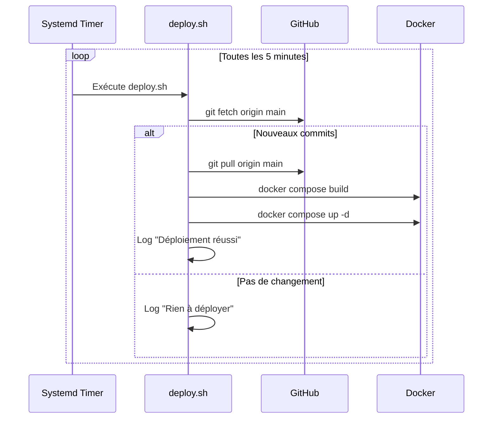

# Auto-update

Nathan-Dash se met à jour **tout seul** quand tu push sur la branche `main`.

---

## Comment ça marche



---

## Le script deploy.sh

Le script `deploy.sh` fait tout le travail :

1. **Fetch** — Vérifie s'il y a des nouveaux commits sur `main`
2. **Compare** — Compare le hash local avec le hash distant
3. **Pull** — Télécharge les changements si nécessaire
4. **Build** — Reconstruit l'image Docker
5. **Deploy** — Redémarre le container avec la nouvelle image
6. **Log** — Enregistre le résultat dans `deploy.log`

---

## Gestion du timer

### Voir le statut

```bash
# Statut du timer
sudo systemctl status nathan-dash-updater.timer

# Dernière exécution
sudo systemctl status nathan-dash-updater.service

# Logs détaillés
sudo journalctl -u nathan-dash-updater.service --since "1 hour ago"
```

### Modifier la fréquence

```bash
# Ouvrir le timer
sudo systemctl edit nathan-dash-updater.timer --full
```

Modifie `OnUnitActiveSec` :

| Valeur | Fréquence |
|---|---|
| `60` | 1 minute |
| `300` | 5 minutes (défaut) |
| `600` | 10 minutes |
| `1800` | 30 minutes |
| `3600` | 1 heure |

```bash
# Recharger après modification
sudo systemctl daemon-reload
```

### Arrêter / Relancer

```bash
# Arrêter l'auto-update
sudo systemctl stop nathan-dash-updater.timer

# Relancer
sudo systemctl start nathan-dash-updater.timer

# Désactiver au boot
sudo systemctl disable nathan-dash-updater.timer
```

---

## Déploiement manuel

Tu peux toujours déclencher un déploiement manuellement :

```bash
cd ~/Nathan-dash
./deploy.sh
```

Ou avec le mode **watch** (surveille en continu) :

```bash
./deploy.sh --watch
```

---

## Logs de déploiement

```bash
# Derniers déploiements
tail -20 ~/Nathan-dash/deploy.log

# Suivre en direct
tail -f ~/Nathan-dash/deploy.log
```

Exemple de sortie :

```
[2025-01-15 14:32:05] Vérification des mises à jour...
[2025-01-15 14:32:06] Nouveaux commits détectés
[2025-01-15 14:32:06] Pull des changements...
[2025-01-15 14:32:15] Build Docker...
[2025-01-15 14:32:45] Redémarrage du container...
[2025-01-15 14:32:47] Déploiement réussi !
```
