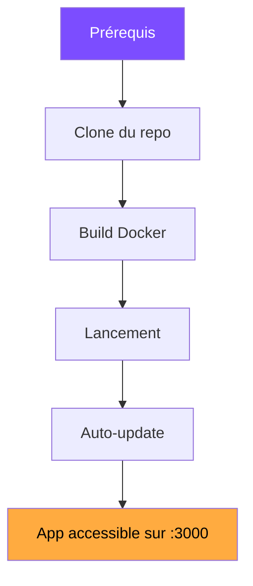

# Guide d'installation

Bienvenue ! Ce guide va t'accompagner **pas à pas** pour installer Nathan-Dash sur ton serveur ou ton PC.

---

## Quel chemin choisir ?

:material-lightning-bolt:

### Installation rapide

**Une seule commande** et tout est installé automatiquement : Docker, le projet, le déploiement, l'auto-update.

:material-timer: ~5 minutes

[:material-arrow-right: C'est parti](one-liner.md){ .md-button .md-button--primary }

:material-wrench:

### Installation manuelle

Tu veux **comprendre chaque étape** et garder le contrôle total ? Ce guide détaille tout.

:material-timer: ~15 minutes

[:material-arrow-right: Guide manuel](manuelle.md){ .md-button }

---

## Vue d'ensemble

Voici ce que le processus d'installation met en place :

| Etape | Ce qui se passe |
|---|---|
| **Prérequis** | Git, Docker et Docker Compose sont installés |
| **Clone** | Le repo privé est cloné avec ton token GitHub |
| **Build** | L'image Docker est construite (Node + Nginx) |
| **Lancement** | Le container démarre sur le port 3000 |
| **Auto-update** | Un timer vérifie les mises à jour toutes les 5 min |
