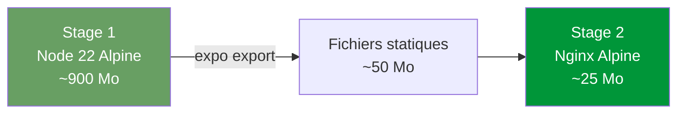

# Docker

Nathan-Dash utilise Docker pour garantir un déploiement identique partout.

---

## Multi-stage build

Le `Dockerfile` utilise 2 étapes pour une image finale légère :



### Stage 1 — Builder

```dockerfile
FROM node:22-alpine AS builder
WORKDIR /app
COPY package*.json ./
RUN npm ci
COPY . .
RUN npx expo export --platform web
```

- Installe les dépendances Node
- Exécute le build Expo pour le web
- Génère les fichiers statiques dans `/app/dist`

### Stage 2 — Runtime

```dockerfile
FROM nginx:alpine
COPY nginx.conf /etc/nginx/conf.d/default.conf
COPY --from=builder /app/dist /usr/share/nginx/html
HEALTHCHECK CMD wget -qO- http://localhost/ || exit 1
```

- Copie uniquement les fichiers statiques (pas de Node en prod)
- Nginx sert l'app avec gzip et cache
- Health check intégré

---

## Docker Compose

```yaml title="docker-compose.yml"
services:
  app:
    build: .
    container_name: nathan-dash-app
    restart: unless-stopped
    ports:
      - "3000:80"
    healthcheck:
      test: ["CMD", "wget", "-qO-", "http://localhost/"]
      interval: 30s
      timeout: 10s
      retries: 3
```

| Paramètre | Valeur | Description |
|---|---|---|
| `restart` | `unless-stopped` | Redémarre auto sauf si arrêté manuellement |
| `ports` | `3000:80` | Port 3000 externe → 80 interne (Nginx) |
| `healthcheck` | wget toutes les 30s | Vérifie que l'app répond |

---

## Commandes Docker utiles

```bash
# Voir le statut du container
docker compose ps

# Voir les logs en direct
docker compose logs -f

# Redémarrer
docker compose restart

# Rebuild complet
docker compose build --no-cache && docker compose up -d

# Entrer dans le container
docker compose exec app sh

# Nettoyer les vieilles images
docker image prune -f
```

---

## Performances

L'image finale fait environ **25 Mo** grâce à :

- Nginx Alpine (image minimale)
- Pas de Node.js en production
- Compression gzip activée
- Cache des assets statiques (1 an pour `/static/`)
