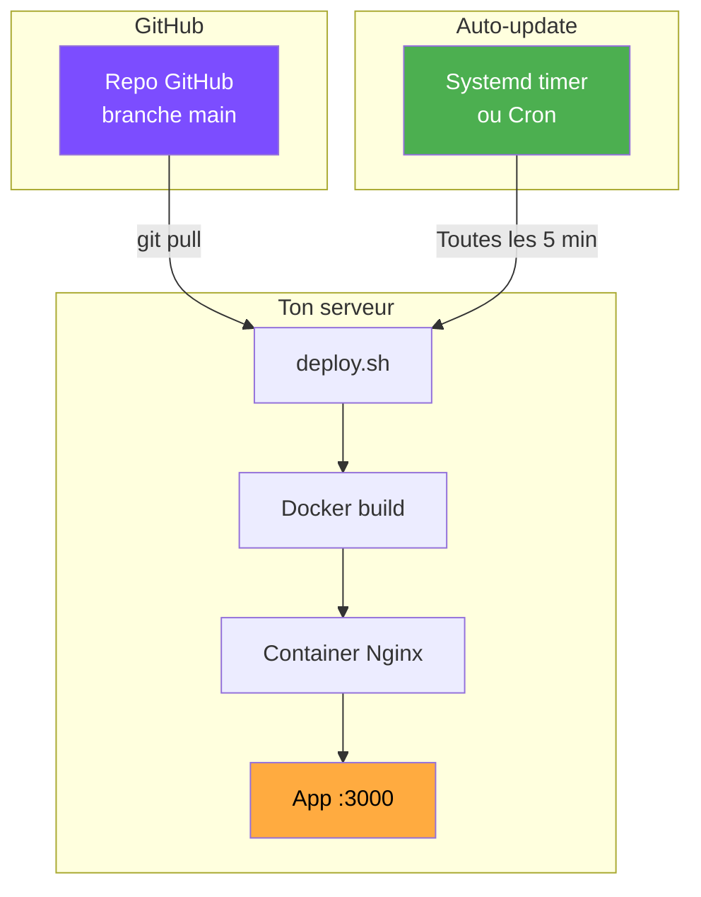

# Déploiement

Nathan-Dash est conçu pour être déployé facilement et se maintenir tout seul.

---

## Architecture

---

## Guides

:material-docker:

### [Docker](docker.md)
Comment fonctionne le build Docker et le déploiement en container.

:material-update:

### [Auto-update](auto-update.md)
Déploiement continu automatique à chaque push sur `main`.

:material-github:

### [GitHub Pages](github-pages.md)
Comment cette documentation est déployée automatiquement.

